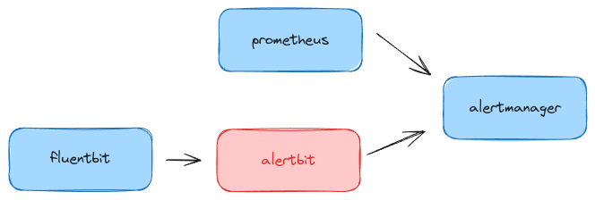

# AlertBit

Welcome to AlertBit, an integration tool designed to bridge Fluent Bit with
Prometheus' Alertmanager, enabling dynamic alerting capabilities based on logs
and events captured by Fluent Bit. AlertBit listens for HTTP POST requests from
Fluent Bit and converts these into alerts that are then forwarded to Prometheus'
Alertmanager. This allows for flexible and powerful notification workflows,
leveraging the extensive capabilities of Alertmanager's receivers.




## Alertbit configuration

Alertbit can takes a full Prometheus configuration file, but only uses the alerting part:

```yaml
alerting:
  alertmanagers:
  - static_configs:
      - targets:
        - 127.0.0.1:9093
```

This enables you to reuse the exact same service discovery as Prometheus itself,
discovering the same alertmanager targets.

## Command line flags

```
usage: alertbit [<flags>]

A bridge between fluentbit and alertmanager.


Flags:
  --[no-]help               Show context-sensitive help (also try --help-long and --help-man).
  --addr=":8090"            HTTP server listen address
  --sd-config="config.yml"  Service Discovery
  --labels=LABELS ...       Extra labels
  --ignore-label=IGNORE-LABEL ...
                            Label to ignore
  --ttl=300s                Alerts time to live
  --[no-]now                Use current time
```

## Docker image

A docker image is available at [`quay.io/o11ydev/alertbit`](https://quay.io/repository/o11ydev/alertbit)

## License

Apache License 2.0, see [LICENSE](LICENSE).
